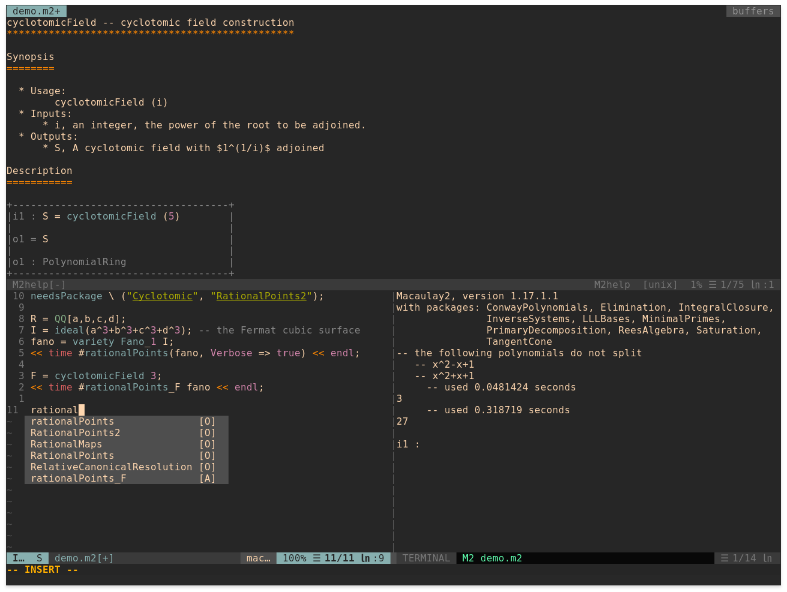

# vim-macaulay2

Basic vim plugin for the [Macaulay2](http://macaulay2.com/) language.

Syntax highlighting will highlight all the core keywords automatically generated by the [official](https://github.com/Macaulay2/language-macaulay2/) code, but also those exported by packages, which are not included in the official file. This also allows these keywords to be used in auto-completion.

The plugin also features shortcuts for viewing the documentation: use `<localleader>h` to open a new buffer displaying the documentation for the expression under cursor. Again this is available for not just the core ones but also those exported from packages.

Install with [vim-plug](https://github.com/junegunn/vim-plug) by adding the following line to the `.vimrc` file
```
Plug '8d1h/vim-macaulay2'
```
### List of commands
* `<localleader>h` shows help for the command under cursor
* `<localleader>H` shows help for the command typed in
* `<localleader>r` saves and runs the current script
* `<localleader>s` opens an M2 shell and preloads the script
* `<localleader>S` opens a clean M2 shell


