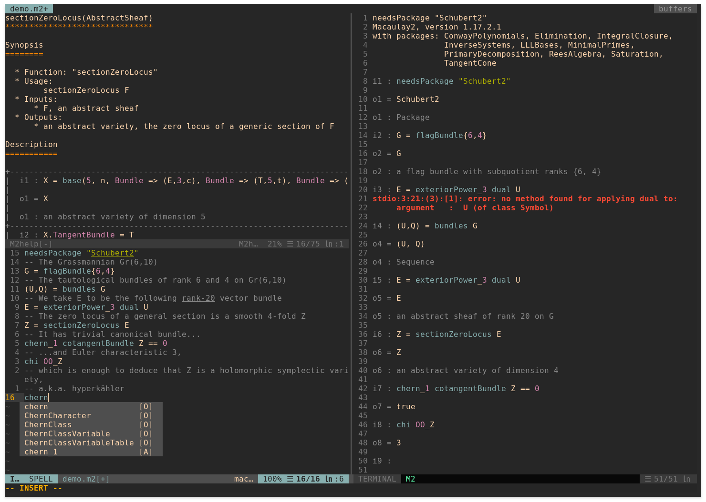

# vim-macaulay2

Basic vim plugin for the [Macaulay2](http://macaulay2.com/) language.

Install with [vim-plug](https://github.com/junegunn/vim-plug) by adding the
following line to the `.vimrc` file
```
Plug '8d1h/vim-macaulay2'
```

## Syntax highlighting

Syntax highlighting will highlight all the core keywords, which are
automatically generated from the official code (the list can be manually
updated by calling the function `:call macaulay2#generate_symbols()`). Keywords
exported by packages are not included in the official file, but will also be
highlighted using a dynamical syntax file. This also allows these keywords to
be used in auto-completion.

## Documentation viewer

A large part of Macaulay2 is very well documented. The plugin features
shortcuts for easily accessing the documentation: use `K` in normal and visual
mode to show the documentation for the expression under cursor. Again this can
be used on all available commands, including those exported from packages.

## Macaulay2 shell

A new feature is the integration of the Macaulay2 shell. Currently this is only
implemented in Neovim.

Typing `Enter` in normal mode will send the current line to the Macaulay2 shell
for evaluation. Block of codes can be selected in visual mode. The shell can
also be evoked using `<localleader>s` and `<localleader>S` (lower s will open a
shell and preload the script, and upper S will open a clean M2 shell instead;
`<localleader>r` can also be used for a quick evaluation). Basic syntax
highlighting is available for the shell.

Also there is now an emacs-like "presentation mode": use `<localleader>p` in a
script will open a new shell in fullscreen for presentation. The lines in the
script will be sent one-by-one to the shell for evaluation by repeatedly typing
`Enter` (`<ctrl-r>` will "reload" the presentation to start from the
beginning).

## List of commands
* `K` shows help for the command under cursor
* `<localleader>K` shows help for the command typed in
* `<localleader>r` saves and runs the current script
* `<localleader>s` opens an M2 shell and preloads the script
* `<localleader>S` opens a clean M2 shell
* `<Enter>` sends a line to the M2 shell for evaluation
* `<localleader>p` evokes the "presentation mode": the lines are displayed
  one-by-one by typing `<Enter>` in normal mode in the terminal buffer.


